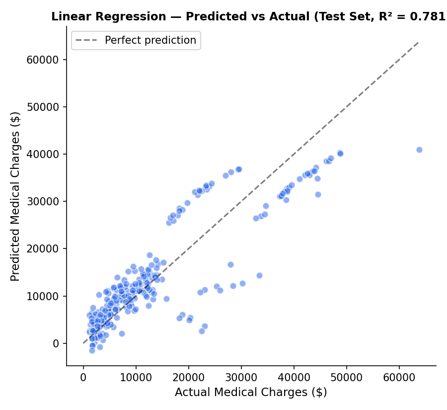
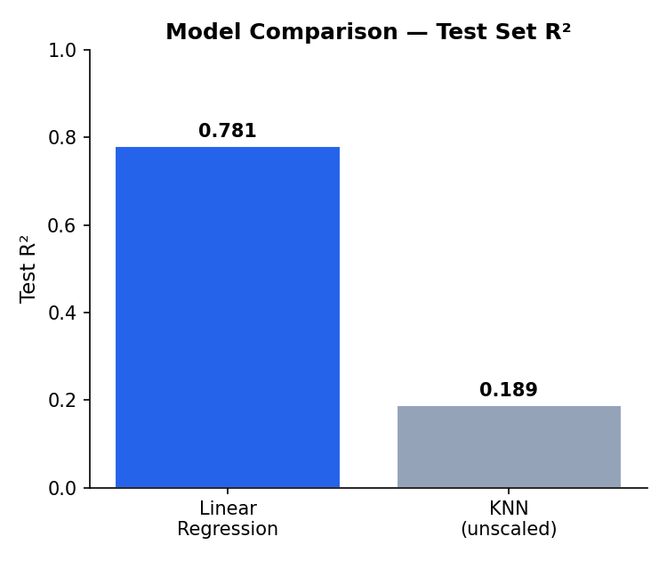

# Insurance Cost Prediction

Predicts annual medical insurance charges from patient demographics (age, BMI, children, smoking status) using regression and instance-based methods, with statistical feature selection and model comparison.

**Dataset:** 1,338 records · 7 features (medical-charges dataset)

## Results

| Model | Test R² |
|---|---|
| **KNN Regressor (scaled)** | **0.852** |
| Linear Regression | 0.781 |





**Read on results:** KNN outperforms Linear Regression once features are properly scaled (`RobustScaler`) — an earlier version of this project ran KNN on unscaled features and it badly underperformed (R² ≈ 0.19), which masked its real potential. Distance-based models like KNN require scaled inputs to work correctly; fixing that revealed KNN actually captures the relationship between demographics and charges better than a linear model, most likely because the true relationship (e.g. the sharp cost jump for smokers) isn't purely linear.

## Pipeline

- **EDA:** distribution analysis, skewness checks, and category proportions across age, BMI, children, smoker, and region
- **Statistical testing:** one-way ANOVA on categorical predictors (smoker, region, sex) against charges
- **Feature selection:** compared RFECV, forward selection, and backward elimination (all converged on `age`, `bmi`, `children`, `smoker`)
- **Modeling:** OLS regression (statsmodels) for interpretability, scikit-learn LinearRegression for train/test evaluation, and KNN Regressor with RobustScaler for outlier-resistant scaling
- **Model comparison:** 5-fold cross-validation + held-out test set for both models

## Tools used

Python · Pandas · scikit-learn · statsmodels · SciPy · Plotly · Matplotlib · Seaborn

## Project structure

```
insurance_cost_prediction.py    # Full pipeline: EDA, ANOVA, feature selection, modeling, comparison
pred_vs_actual.png              # Predicted vs actual charges, both models side by side
r2_comparison.png               # R² comparison bar chart
```

## How to run

```bash
pip install pandas scikit-learn statsmodels scipy plotly matplotlib seaborn
python insurance_cost_prediction.py
```

## Author

Youssef Taha — Statistics undergraduate, Cairo University
